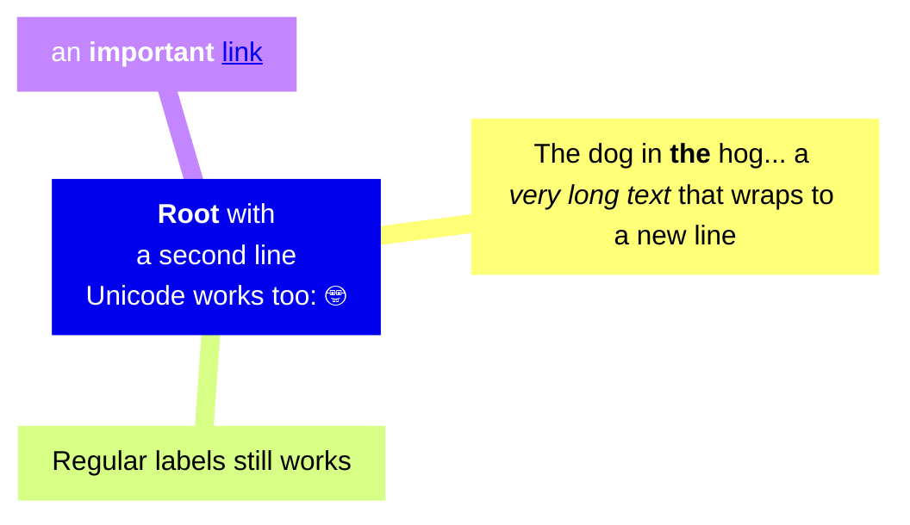

## 📡 이런 분야에 관심 있어요.

- 데이터
    - 데이터 엔지니어링
    - ETL 처리 및 관리
    - 데이터 분석
    - 시각화
- 백엔드 개발
- 자동화
- 패턴 분석

## 📝 최근에 이런 글을 작성했어요.

<!-- BLOG-POST-LIST:START -->
- [[주간회고] 2025년 1주차 &lpar;1월&rpar;](https://blex.me/@mildsalmon/%EC%A3%BC%EA%B0%84%ED%9A%8C%EA%B3%A0-2025%EB%85%84-1%EC%A3%BC%EC%B0%A8-1%EC%9B%94)
- [24년에 읽은 것 정리](https://blex.me/@mildsalmon/24%EB%85%84%EC%97%90-%EC%9D%BD%EC%9D%80-%EA%B2%83-%EC%A0%95%EB%A6%AC)
- [24년 회고를 하겠습니다. 근데 이제 ai를 곁들인](https://blex.me/@mildsalmon/24%EB%85%84-%ED%9A%8C%EA%B3%A0%EB%A5%BC-%ED%95%98%EA%B2%A0%EC%8A%B5%EB%8B%88%EB%8B%A4-%EA%B7%BC%EB%8D%B0-%EC%9D%B4%EC%A0%9C-ai%EB%A5%BC-%EA%B3%81%EB%93%A4%EC%9D%B8)
- [[주간회고] 2024년 51주차 &lpar;12월&rpar;](https://blex.me/@mildsalmon/%EC%A3%BC%EA%B0%84%ED%9A%8C%EA%B3%A0-2024%EB%85%84-51%EC%A3%BC%EC%B0%A8-12%EC%9B%94)
- [[주간회고] 2024년 50주차 &lpar;12월&rpar;](https://blex.me/@mildsalmon/%EC%A3%BC%EA%B0%84%ED%9A%8C%EA%B3%A0-2024%EB%85%84-50%EC%A3%BC%EC%B0%A8-12%EC%9B%94)
<!-- BLOG-POST-LIST:END -->




```plantuml
Alice -> Bob: Authentication Request
Bob --> Alice: Authentication Response
   
Alice -> Bob: Another authentication Request
Alice <-- Bob: Another authentication Response
```

> [!NOTE]  
> Highlights information that users should take into account, even when skimming.

> [!TIP]
> Optional information to help a user be more successful.

> [!IMPORTANT]  
> Crucial information necessary for users to succeed.

> [!WARNING]  
> Critical content demanding immediate user attention due to potential risks.

> [!CAUTION]
> Negative potential consequences of an action.

## 😎 저는 이런 시스템을 만들어서 공부하고 있어요.

[Study/readme.md at master · mildsalmon/Study (github.com)](https://github.com/mildsalmon/Study/blob/master/readme.md)

## 🖋 지식을 코드에 적용하여 정리해봤어요.

[CodingTest-Study/readme.md at master · mildsalmon/CodingTest-Study (github.com)](https://github.com/mildsalmon/CodingTest-Study/blob/master/readme.md)

## 📑 깃헙 활동을 간단하게 요약했어요.

[](https://github.com/mildsalmon)

## 🥇 이런 언어를 자주 사용해요.

[](https://github.com/mildsalmon)

## 🔮 이런 소셜에서 활동하고 있어요.

<p>

<a href="https://blex.me/@mildsalmon/about">
    
</a>

<a href="https://solved.ac/profile/mildsalmon">
    
</a>

## 📜 제 이력서에요 !

<!-- <a href="https://mildsalmon.notion.site/c6540c28f55a4d90b4d2dcb181e15307">
    
</a>

<a href="https://mildsalmon.notion.site/c6540c28f55a4d90b4d2dcb181e15307">
    
</a>
    
<a href="https://mildsalmon.notion.site/c6540c28f55a4d90b4d2dcb181e15307">
    
</a>
    
<a href="https://mildsalmon.notion.site/c6540c28f55a4d90b4d2dcb181e15307">
    
</a> -->
    
<a href="https://mildsalmon.notion.site/c6540c28f55a4d90b4d2dcb181e15307">
    
</a>
    

---

<p align="center">
    <a href="https://github.com/mildsalmon/">
        
    </a>
</p>

